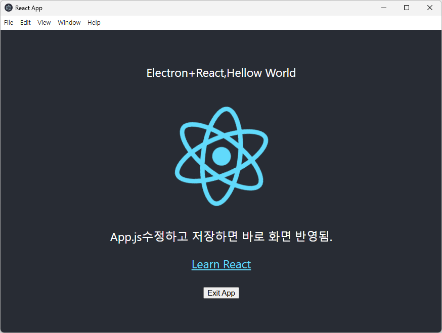

# Getting Started with Electron + React Desktop App


## Installation

* react-electron폴더를 만들고 react기본 템플릿으로 project를 생성한다.
npx create-react-app react-electron
cd react-electron
code .


### Modify package.json
```
"main": "src/main.js",

"scripts": {
    "electron": "electron ." 
}
```


## Make main.js and edit
 
- win.loadURL("http://localhost:3000")


## Make main.js and edit (Electron과 React동시 실행위함)

yarn add --dev concurrently wait-on

```
"scripts": {
    "start": "concurrently \"yarn react-scripts start\" \"yarn electron\" ",
    "build": "react-scripts build",
    "test": "react-scripts test",
    "eject": "react-scripts eject",
    "electron": "wait-on http://localhost:3000 && electron ."
},
```


## root 폴더에 .env 파일을 만들고, 다음 내용을 추가합니다
```
BROWSER=none
```


## Run program
yarn start





## Test 결과

- 최초 실행시 화면이 보이기까지 10초이상 걸림
- 두번째 실행시 2초 이내 실행됨.
- App.js수정하면 바로바로 Electron실행화면에 반영됨.
- 실행단계를 추적해보면
  yarn react-scripts start 로 React가 실행되는데,
  index.js 가 로딩하면서, App.js를 실행하여 localhost:3000서버가 만들어진다.

  그 다음 yarn electron 으로 electron이 실행되고, 
  main.js에서 localhost:3000에 접속하게되고, Web화면이 Electron화면에 보이게된다.